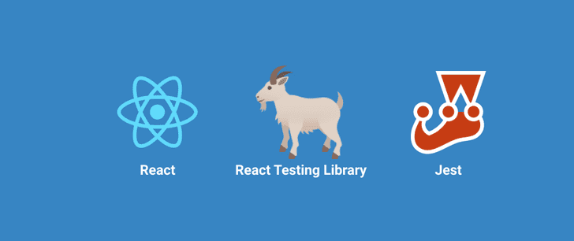
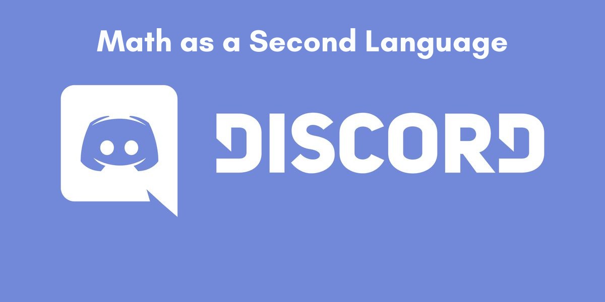

# Testing React Apps with React Testing Library (RTL)

Hi! If you are here, that means that you enrolled to my course (or you visited my profile :smirk:).

You can check out my Udemy course here: [Testing React apps with React Testing Library (RTL) by David Armendáriz](https://www.udemy.com/course/testing-react-apps-with-react-testing-library-rtl/?referralCode=047B3A2FDC682BD91075)

If you have any questions, you can [join the Discord server](https://discord.gg/ej2F3Qj) of Math as a Second Language

